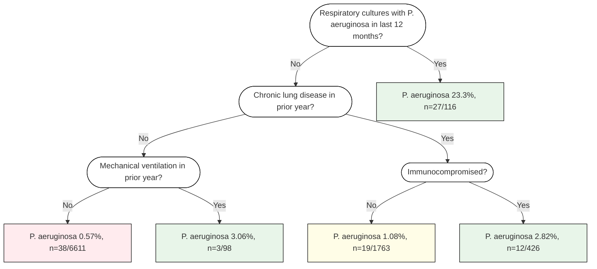

# ODACORE_VISION.md

Maintainer: Nathaniel J. Rhodes, PharmD, MSc
Repository: https://github.com/njrhodes/oda_rcore
Updated: 2026-05-12

---

## 1. What odacore is

odacore is a pure-R reimplementation of the MegaODA.exe / CTA.exe statistical
classification engine. Where gold executable coverage exists, the correctness
standard is the Windows executable: any divergence from exe output on a covered
fixture is a bug in odacore, not an alternative interpretation.

The package removes the Windows x86 binary dependency so that ODA and CTA
analyses can run cross-platform, be embedded in R workflows, tested with
standard CI tooling, and extended (novometric MDSA, interpretability artifacts)
without touching the exe.

Extensions beyond exe behavior are allowed only when clearly marked as
extensions and must not alter parity behavior on covered fixtures.

---

## 2. Current production state

### Architecture

```
utils.R          ← shared primitives (%||%, tick(), fmt helpers, .validate_case_weights())
    ↓
unioda_core.R    ← binary ODA engine (oda_univariate_core)
multioda_core.R  ← multiclass ODA engine (oda_multiclass_unioda_core)
    ↓
oda_fit.R        ← unified dispatcher: C=2 → binary, C≥3 → multiclass
oda_s3.R         ← ODA S3 methods: predict/print/summary for oda_fit
    ↓
cta_core.R       ← CTA recursive tree (oda_cta_fit, predict.cta_tree, helpers)
cta_s3.R         ← CTA S3 + translation layer: summary/print/accessors/staging/
                   propensity/assign_endpoints/observation_weights
cta_family.R     ← MDSA family: cta_descendant_family(), cta_family_table(),
                   summary/print methods for cta_family
```

No circular dependencies. CTA calls `oda_fit()` and reads standardized result
fields; it knows nothing about the internal structure of either ODA engine.

### Public API

**Entry points (public API):**
- `oda_fit(x, y, w, ...)` — primary ODA dispatcher (binary and multiclass)
- `cta_fit(X, y, w, ...)` — public CTA tree constructor

**Internal / compatibility names:**
- `oda_cta_fit(X, y, w, ...)` — CTA engine (internal name; `cta_fit()` is
  the preferred public entry point; `oda_cta_fit()` retained for backward
  compatibility)
- `oda_univariate_core(...)` — binary ODA engine (direct internal access)
- `oda_multiclass_unioda_core(...)` — multiclass ODA engine (direct internal access)

**Prediction / inspection:**
- `predict.cta_tree(object, newdata, missing_action = c("majority", "na"))`
- `print.cta_tree(x)`
- `cta_node_table(tree)`
- `oda_rule_predict(x, rule)`
- `oda_rule_predict_multiclass(x, rule, boundary)`

**Metrics:**
- `oda_confusion_binary`, `oda_confusion_multiclass`
- `oda_mean_pac`, `oda_ess_from_meanpac`, `oda_ess_from_mean`

**CTA reporting and translation:**
- `cta_endpoint_summary(tree)`
- `cta_endpoint_counts(tree)`
- `cta_staging_table(tree, target_class, ...)`
- `cta_propensity_weights(tree, target_class, ...)`
- `cta_assign_endpoints(tree, newdata, ...)`
- `cta_observation_weights(tree, newdata, y, ...)`
- `cta_confusion_table(tree)`

**MDSA family:**
- `cta_descendant_family(X, y, w, ..., start_mindenom, max_steps)`
- `cta_family_table(family)`

**Reliability:**
- `novo_boot_ci(confusion, nboot, seed, ...)` — fixed-confusion NOVOmetric
  bootstrap CI on a C×C confusion matrix. Resamples classification outcomes
  from the stored confusion; does not refit ODA/CTA and does not estimate
  model-selection uncertainty.

**CTA graphics (output/interpretation layer):**
- `cta_plot_data(tree, target_class, ...)` — derived tree diagram data
- `plot.cta_tree(x, target_class, ...)` — native base-R tree diagram

### Return value contract

- `$confusion` — always raw integer counts (rows = actual, cols = predicted)
- `$confusion_wt` — priors-weighted matrix (diagnostics only)
- `$pac`, `$mean_pac`, `$pac_by_class` — in [0, 100]
- `$sensitivity`, `$specificity`, `$accuracy` — in [0, 1]
- `$ess`, `$wess` — in [0, 100]; WESS only when WEIGHT command is active

### Covered fixture validation status

| Dataset    | MINDENOM | Type               | Status   | Key anchor                        |
|------------|----------|--------------------|----------|-----------------------------------|
| iris V1–V4 | —        | MultiODA           | ✓ green  | All 4 attributes, K=3 ordered     |
| CTA_DEMO   | 1        | CTA (no weights)   | ✓ green  | Root V2, cut 4.5, ESS 52.63%      |
| CTA_DEMO   | 8        | CTA (no weights)   | ✓ green  | mc_iter=25000, ESS 68.08%         |
| myeloma    | 1        | CTA (WEIGHT V2)    | ✓ green  | V14→V15, WESS 27.69%, n=255       |
| myeloma    | 30       | CTA (WEIGHT V2)    | ✓ green  | V17 stump, WESS 16.51%, n=186     |
| myeloma    | 56       | CTA (WEIGHT V2)    | ✓ green  | No tree (all child sizes < 56)    |

**Validation status as of f0328e2:**
- Fast suite: 941 pass / 163 skip / 0 fail / 0 warn
- Targeted smoke: 173 pass / 0 skip / 0 fail / 0 warn
- `devtools::check()`: 0 errors / 0 warnings / 1 known Windows clock NOTE
  (environment timing issue, not a package defect)

See `CLAUDE.md` for current validation commands and tier definitions.

### Key CTA implementation details

**Weighted ordered scan + LOO STABLE gate** (commit 85459a4):
- `.cta_ordered_scan()` selects the rightmost cut where the class-1
  right-branch priors-adjusted PAC > 0.5.
- LOO STABLE requires WESSL = WESS (|delta| ≤ 0.01 pp). Signif T alone is
  insufficient.
- Binary attributes (≤ 2 unique values) and uniform-weight datasets bypass the
  CTA path and use generic ODA.

**Root-only ENUMERATE stump phase** (commit a2e2a9d):
- After the expanded ENUMERATE loop (candidate trees grown below each root),
  a second loop evaluates each root candidate as a stump scored path-locally.
- Observations missing the root attribute are excluded (NA), not majority-routed.
- Root-only stump candidates compete against expanded candidates; best WESS wins.
- This matches CTA.exe Trees 5–7 behavior in MODEL1.TXT.
- **Do not globally apply path-local scoring to expanded ENUMERATE candidates.**
  This was attempted twice and reverted; it incorrectly displaces correct
  expanded trees for MINDENOM=1.

**MINDENOM:**
- Raw child-node row-count admissibility. Unweighted, no priors adjustment.

**`missing_action` in `predict.cta_tree()`:**
- `"majority"` (default) — majority-fallback; used in expanded ENUMERATE scoring.
- `"na"` — canonical path-local missingness; returns NA_integer_ for missing obs.

---

## 3. Selection algorithm — proven invariants

Reverse-engineered from MegaODA.exe runs and locked by fixture tests.

```
For each cut position r (enumeration order):
  Within-cut (inner) — best segment assignment:
    PRIMARY   = MAXSENS  (mean PAC in priors-weighted space)
    SECONDARY = SAMPLEREP  (L1 distance, RAW counts always)
    FALLBACK  = FIRST ASSIGNMENT ENUMERATED

Across cut positions (outer):
    PRIMARY   = MAXSENS
    FALLBACK  = FIRST CUT POSITION ENUMERATED  (not SAMPLEREP)
```

Key proofs:
- iris V1: cuts 6.15 vs 6.25 — same PAC, raw SREP favors 6.25, MegaODA
  chose 6.15 → first-cut wins across cut positions.
- DAT5: assignments (2,1,3) vs (1,2,3) at same cut — SREP picks (2,1,3)
  → SREP operates within a cut position on assignment ties.
- SAMPLEREP is always raw counts. Using priors-weighted space is a bug.

---

## 4. Novometric axioms

### Axiom 1 — Sample size / exact distribution

For binary class × binary attribute, unit-weighted UniODA exact distributions
converge to Fisher's exact test. More general ODA exact p-values are obtained
through Fisher randomization / permutation or require further exact-distribution
theory. Additional theory is needed for sample-size calculation for the ODA
exact distribution.

### Axiom 2 — Structural Decomposition Analysis (SDA)

SDA is used in multiattribute applications to identify the attribute subset
producing the GO-CTA model. It is analogous to PCA but maximizes predictive
accuracy rather than explained variance. It selects attributes successively
over monotonically diminishing sample partitions:

In step 1, EO-CTA is applied and the attribute yielding the minimum D statistic
with exact p < 0.05 is selected. Correctly classified observations are then
removed and the selected attribute is omitted from later steps. The process
repeats on the remaining misclassified observations until all observations in
either class are correctly classified, p > 0.05, or too few observations remain
to satisfy Axiom 1.

D is the parsimony-normalized criterion:

```
D = 100 / ((ESS_or_WESS) / strata_length) - strata_length
```

Where `strata_length` counts terminal leaf endpoints only; internal and
intersection nodes are not counted. MPE defines D as [100 / (ESS / strata)] − strata,
where strata is the number of strata/endpoints. Use WESS in place of ESS only
as odacore weighted-extension language when case weights are declared.

### Axiom 3 — MDSA descendant family

MDSA operates on EO-CTA models configured on the SDA-selected attribute subset.
Starting from MINDENOM 1, the descendant family is traced by computing the
minimum terminal endpoint denominator of the current model and stepping to:

```
Next MINDENOM = current model's minimum terminal endpoint denominator + 1
```

Myeloma example:
- MINDENOM 1 model has minimum terminal endpoint denominator 29 → next MINDENOM 30.
- MINDENOM 30 stump has minimum terminal endpoint denominator 55 → next MINDENOM 56.
- MINDENOM 56 yields no feasible tree → terminate.

No-tree states have no terminal endpoint denominators and terminate the
descendant family. The resulting sequence {MINDENOM 1, 30, 56} is the descendant
family; the minD model is selected from the feasible members.

### Axiom 4 — Reliability

MPE canon: hold-out, LOO/jackknife, bootstrap, or test-retest validity analyses
estimate cross-generalizability of D, ESS, ESP, and related performance indices.

odacore planning policy: reliability status should be represented explicitly;
when a workflow declares reliability as an acceptance criterion, only reliable
complete models should compete. If multiple reliable models exist, theoretical
or empirical use considerations must be weighed.

---

## 5. Phase map

### Phase 0 — Completed: parity stabilization ✓

- UniODA / MultiODA parity on covered fixtures (iris, synthetic tie-breaking).
- Binary CTA fixture parity for CTA_DEMO (MINDENOM 1 and 8) and myeloma
  (MINDENOM 1, 30, 56).
- Weighted ordered scan + LOO STABLE gate.
- Root-only ENUMERATE stump phase.
- Package hygiene: 0 errors / 0 warnings on devtools::check().
- Dev-only theory assets removed from package tracking and build.
- Copilot review instructions established.

### Phase 1 — Completed: documentation and canon alignment ✓

- CLAUDE.md, data-raw/README.md, ODACORE_VISION.md aligned to current state.
- Copilot instructions cover all known parity invariants and scope limits.
- No behavior changes.

### Phase 2 — Object contracts, reporting, MDSA, and interpretability

Phase 2 turns the stabilized inference engine into a usable analytic system.
The first priority is not new search logic; it is a reliable object contract
for fitted ODA/CTA models. MDSA, D-statistic comparison, staging tables,
visualization, and auto_SDA should build on that contract rather than
duplicating fit-specific logic.

odacore is now a parity-stabilized inference engine, but it is still bare-bones
as a user-facing analytic package. `oda_fit()` has no `predict()` method, no
S3 class, and no polished reporting layer. CTA has `predict.cta_tree()`,
`print.cta_tree()`, and `cta_node_table()`, but reporting is still minimal.
CTA no-tree fits now have explicit `no_tree` handling and must not silently
predict majority class.

**Object-system decision: S3 classed lists, not R6.**

Rationale:
- S3 is idiomatic for R statistical model objects.
- S3 preserves current list fields and backward compatibility.
- S3 supports `print()`, `summary()`, `predict()`, and accessors naturally.
- S3 keeps objects transparent for fixture parity debugging.
- R6 is unnecessary unless a future interactive app needs mutable session state.
- Do not introduce hidden mutable state or expensive recomputation inside object
  methods.

**Canon constraints for this phase:**
- ESS/WESS are computed from Mean PAC across all classes.
- Use WESS when weights are declared; otherwise use ESS.
- Raw confusion and weighted confusion must both remain accessible and must not
  be mixed.
- LOO is true refit-per-fold validity analysis, not the training objective.
- LOO STABLE is a CTA gate requiring ESSL/WESSL = ESS/WESS; it is not itself
  a p-value.
- MC p-values come from Fisher randomization / permutation.
- LOO p-values must be explicitly computed if reported. For binary node-level
  ODA/CTA splits, planned LOO p-values should be Fisher exact tests on the
  LOO/test confusion table, or document if Fisher randomization is used instead.
  For multiclass LOO, do not invent a formula — it may require simulated
  Fisher/randomization for K > 2 classes; mark as open design until canon is
  confirmed. No fake LOO p-values: if LOO p is not explicitly computed, summary
  must show `NA`, omit it, or mark it unavailable with a reason.
- No multiclass CTA parity claim. Multiclass CTA remains future extension.

**MPE reporting canon:**
- CTA endpoints can be reported as staging tables.
- A staging table reorganizes terminal endpoints in increasing target-class
  propensity/severity.
- Rows describe endpoint rule/path, endpoint N, class-1 or target-class
  proportion, and odds/propensity information where applicable.
- Staging tables are a reporting artifact for CTA endpoints, not a new model.

#### Phase 2A — ODA S3 object contract, prediction, and summaries

**Problem:** `oda_fit()` results are currently bare list-like outputs with no
stable S3 reporting or prediction contract.

**Plan:**

1. Add classed return objects while preserving existing fields:
   - `oda_fit_binary`
   - `oda_fit_multiclass`
   - shared parent class `oda_fit`

2. Add `predict.oda_fit()`:
   - Supports binary and multiclass ODA rule types.
   - Does not create a public `predict(fit$rule, ...)` API unless separately
     designed.
   - Missing values / miss codes return `NA_integer_` unless a documented
     policy says otherwise.
   - Predictions return labels in the caller's original class-label space.
   - Failed/degenerate ODA fits must have explicit prediction behavior before
     implementation.

3. Add `print.oda_fit()`:
   - Compact display: model type; attribute type; priors/weights status; rule;
     train ESS/WESS; train confusion summary; MC p-value only if present; LOO
     status/performance only if present.
   - Do not show LOO p-value unless explicitly computed.

4. Add `summary.oda_fit()`:
   - Structured object, not just console text.
   - Includes train and LOO sections where available.
   - Avoid expensive recomputation by default.
   - Store or expose: train predictions when available or reconstructable; train
     raw confusion; train weighted confusion when weights/priors apply; train PAC
     by class; train Mean PAC across all classes; train ESS/WESS; train MC
     metadata and p-value when run; LOO predictions/confusion/ESS/WESS when LOO
     was run; LOO p-value only if explicitly computed.

5. Add accessors (prefer names that avoid generic conflicts):
   - `oda_predictions(fit, split = c("train", "loo"))`
   - `oda_confusion(fit, split = c("train", "loo"), weighted = FALSE)`
   - `oda_metrics(fit, split = c("train", "loo"))`

**Tests:** Binary predict; multiclass predict; missing-value prediction behavior;
failed/degenerate fit prediction policy; print smoke tests; summary structure
tests; no fake LOO p-value.

#### Phase 2B — CTA summary, endpoint reporting, and staging tables ✓ (complete — first production version)

**Completed:** `summary.cta_tree()`, `print.cta_tree()`, `cta_node_table()`, `cta_endpoint_summary()`,
`cta_endpoint_counts()`, `cta_staging_table()`, `cta_propensity_weights()`, `cta_assign_endpoints()`,
`cta_observation_weights()`, `cta_confusion_table()` are all implemented.
See `docs/CTA_TRANSLATION_STACK.md` (pipeline overview) and `docs/myeloma-cta-translation.md` (worked example).
Lean-fit invariant maintained: `cta_tree` stores only tree nodes, `training_confusion`, and per-leaf
`class_counts_raw`/`class_counts_weighted`.

**Original problem statement (preserved for context):** CTA reporting was minimal; no-tree behavior had been clarified but
summaries did not yet safely expose train/LOO/MC metrics.

**Plan:**

1. Add `summary.cta_tree()`:
   - status: `valid_tree`, `stump`, `no_tree`, possibly `degenerate`;
   - tree type; root attribute; number of split nodes; number of terminal
     endpoints; n_total and n_classified; train raw confusion; train weighted
     confusion when weights exist; train ESS/WESS; MC metadata/p-values where
     stored; LOO STABLE/WESSL/ESSL where stored; endpoint denominators.

2. Improve `print.cta_tree()`:
   - Preserve current node table.
   - Add a short footer with tree-level metrics when available.
   - For no-tree, print clear no-tree message and no misleading metrics.

3. Keep `cta_node_table()` as the node/endpoint table. Confirm no-tree returns
   a safe one-row leaf table.

4. Add a single endpoint-summary object for downstream reporting (staging
   tables, tree diagrams, family comparisons). Should include: endpoint id;
   rule path; terminal prediction; n_total reaching endpoint; n_classified if
   different; raw class counts; weighted class totals when applicable;
   target-class proportion; odds/propensity fields where applicable; endpoint
   denominator; missing/path-local classification counts where available.

5. Add staging-table reporting:
   - `cta_staging_table(tree, target_class = NULL, ...)`.
   - Reorganize terminal endpoints by increasing target-class
     propensity/severity.
   - Include endpoint path/rule descriptor, endpoint N, class counts,
     target-class proportion, and odds/propensity fields where applicable.
   - Follow MPE staging-table concept; do not invent new model semantics.

6. Store fit-time summary fields where already computed. Avoid storing full
   training data unless absolutely necessary. If a metric is not stored,
   summary should show `NA` / unavailable rather than recomputing silently.

**Tests:** CTA_DEMO summary fields; myeloma MINDENOM=1/30/56 summary fields;
no_tree summary and prediction all-NA; endpoint-summary structure; staging
table endpoint ordering; print smoke tests.

#### Phase 2C — LOO p-value design

**Problem:** LOO p-value contract is not fully defined.

**Plan:**

1. Separate fields: `train$mc$p_value`, `loo$p_value`, `loo$mc$p_value` if a
   randomization LOO p procedure is implemented.

2. Binary case: design LOO p-value as Fisher exact testing on the LOO/test
   confusion table, or document if Fisher randomization is used instead.
   Confirm orientation, weighting, and scope before implementation.

3. Multiclass case: open design. Do not implement until canon/statistical target
   is written.

4. Reporting: if LOO p is unavailable, summary must say unavailable/NA. Do not
   infer LOO p from LOO ESS/WESS. LOO STABLE remains a separate gate.

**Deliverable:** Design notes first, implementation later.

#### Phase 2D — D statistic and terminal endpoint denominators ✓ (complete)

**Completed:** `cta_strata()`, `cta_endpoint_denominators()`, `cta_min_terminal_denom()`, `cta_d_stat()`,
and `oda_d_stat()` are all implemented and exported.

**Original problem statement (preserved for context):** MDSA needs a model comparison metric and endpoint denominators.
These must be downstream/reporting functions — not changes to parity selection
logic.

**Plan:**

1. `cta_strata(tree)` — number of terminal leaf endpoints; `NA_integer_` for
   no_tree.

2. `cta_endpoint_denominators(tree)` — terminal endpoint row counts;
   `integer(0)` or `NA` for no_tree.

3. `cta_min_terminal_denom(tree)` — minimum terminal endpoint denominator;
   `NA_integer_` for no_tree.

4. `oda_d_statistic(fit)` / `cta_d_statistic(tree)`:
   - `D = 100 / (ESS_or_WESS / strata_length) - strata_length`
   - Use WESS when weights are declared; otherwise ESS.
   - strata_length counts terminal endpoints only.
   - no_tree returns `D = NA_real_`.
   - ESS/WESS ≤ 0 returns `D = NA_real_` with diagnostic flag.

**Important:** This is comparison/reporting machinery. It must not change CTA
selection behavior.

**Tests:** Known D values for simple fixtures once fields are stable; no_tree D
is NA; endpoint denominator extraction.

#### Phase 2E — MDSA descendant family ✓ (complete — first production version)

**Completed:** `cta_descendant_family()` and `cta_family_table()` are implemented.
The myeloma chain {MINDENOM=1, 30, 56} is a passing regression fixture.
`summary()` and `print()` methods for `cta_family` are implemented.

**Canon:** Next MINDENOM = current model's minimum terminal endpoint denominator
+ 1. No-tree terminates the descendant family.

**API:**

```r
cta_descendant_family(X, y, w = NULL, ..., start_mindenom = 1L,
                      max_steps = 20L)
```

Return class `cta_family`. Fields:
- `members`: list of `cta_tree` objects, including terminal no_tree state.
- `mindenoms`: integer vector of tried MINDENOM values.
- `summary`: data frame with mindenom, status, strata, endpoint_denominators,
  min_terminal_denom, ESS/WESS, D, reliability.
- `min_d_idx`: index of minimum-D feasible member.
- `terminated`: logical.
- `termination_reason`.

Algorithm:
1. Fit CTA at current MINDENOM.
2. Append result.
3. If no_tree, terminate.
4. Compute min_terminal_denom.
5. Next MINDENOM = min_terminal_denom + 1.
6. Stop at max_steps safety cap.
7. Select min-D among feasible members only.

**Tests:** Myeloma chain gives {1, 30, 56}; terminal no_tree handled safely;
min-D selection works once D statistic is stable.

#### Phase 2F — Degeneracy guards and status taxonomy

**Goal:** Do not silently present degenerate output as valid modeling.

**Status taxonomy:**
- ODA: `valid`, `degenerate`, `failed`.
- CTA: `valid_tree`, `stump`, `no_tree`, `degenerate`.
- MDSA member status inherits CTA status.

**Policies:**
- CTA no_tree predicts all `NA_integer_`.
- ODA failed/degenerate prediction policy must be explicit before
  implementation.
- Degenerate solutions may be allowed only behind explicit option.
- Summary/print must flag degeneracy clearly.
- D statistic for no_tree/degenerate/ESS≤0 is NA with reason.

**Tests:** no_tree CTA; ODA degenerate/fail object; D statistic diagnostic
flags.

#### Phase 2G — Model comparison

**API:** `oda_compare(..., labels = NULL)`

Returns data frame: label; model_type; status; objective; n_total;
n_classified; strata; ESS/WESS; train MC p if present; LOO ESS/WESS if
present; LOO p if explicitly computed (else NA); reliability/stability status;
D where defined.

**Scope:** Pure reporting/selection aid. No fitting side effects. No parity
selection changes.

#### Phase 2H — auto_SDA

Planning only after 2A–2G.

**MPE canon:** SDA uses EO-CTA over candidate attributes. Select
attribute/model with minimum D among statistically reliable candidates. Remove
correctly classified observations. Omit selected attribute. Repeat on remaining
observations. Stop when a class is fully correctly classified, p > alpha, too
few observations remain, or max steps reached.

**API:**

```r
oda_sda(X, y, w = NULL, attr_names = NULL, alpha = 0.05,
        mindenom = 1L, max_steps = NULL, ...)
```

Return class `oda_sda`. Fields: step table; selected attributes; fits; D
statistics; n_remaining; n_removed; removed observation indices; termination
reason.

**Important:** Must be built after MDSA and model comparison tools. Do not
invent a greedy shortcut inconsistent with MPE.

#### Phase 2I — Visualization and end-user reporting artifacts ✓ (first production version — commit f0328e2)

**Completed:**
- `cta_plot_data(tree, target_class, ...)` — derives tree diagram data from
  stored leaf counts and node topology. Returns `$nodes`, `$edges`,
  `$endpoints`, `$target_class_used`. When `target_class` is supplied, nodes
  gain `target_n`, `denominator`, `target_proportion`, `target_rank`,
  `endpoint_fill_color`, `stage`, `endpoint_label`, and `has_endpoint`
  columns. No refitting; no training X/y storage; no invented statistics.
  Colors encode relative target-class proportion only — they do not imply
  clinical thresholds or categories.
- `plot.cta_tree(x, target_class, class_labels, endpoint_palette, ...)` —
  native base-R tree diagram. Structural mode (no `target_class`): split
  nodes are ellipses, terminal endpoints are rectangles. Target-enriched mode
  (`target_class` supplied): endpoint fill color encodes `target_proportion`
  via a customizable color palette (`endpoint_palette`). Returns
  `invisible(pd)` for programmatic reuse of plot-data.
- Both functions are on-demand output/interpretation layer — same lean-fit
  principle as the rest of the translation stack.

**Remaining in Phase 2I (not yet implemented):**

1. Native R plotting: future `plot.cta_family()` for MDSA descendant family comparison.

2. Optional text export: future `cta_mermaid(tree, ...)` may export Mermaid
   flowchart text for Quarto/GitHub/Markdown. Mermaid is an export format,
   not the internal R graphics engine.

**Visual grammar:**
- Internal split nodes use human-readable questions/rules.
- Branches labeled with rule direction: Yes/No for binary clinical questions;
  `<= cut` / `> cut` for ordered cuts; category lists for categorical rules.
- Terminal endpoints show: target outcome label; endpoint event rate / class
  proportion; numerator and denominator (e.g. `23.3%, n=27/116`); terminal
  prediction; optional odds/propensity display.
- Endpoint colors may communicate low/middle/high propensity tiers,
  configurable by user.

Example visual grammar from an applied analysis (Mermaid as export target):



This is a visual grammar target, not the required internal implementation.
Internal R logic should produce `cta_plot_data` first; Mermaid is an optional
export layer.

**Visualization must handle:** valid expanded trees; stumps; no_tree safely;
missing/path-local classification counts where available; weighted and
unweighted outcomes.

**Class imbalance / special-use workflows** (record, do not implement as
default):
- Some applied CTA workflows manually restrict the analytic sample down one
  branch before continuing deeper, under extreme class imbalance.
- Example: restrict first to one root branch; define deeper attributes within
  each restricted stratum; remove upstream attributes from later consideration;
  evaluate minD among available attributes; begin with unconstrained denominator
  then increase downward.
- This is a special-use CTA/MDSA workflow under review, not canonical default
  `oda_cta_fit()` behavior.
- Visualization/reporting must be flexible enough to show manually constrained
  branch analyses.
- Model/family objects should eventually record enough provenance to state
  whether a tree was: standard CTA; MDSA descendant family member;
  SDA-selected model; or manually branch-restricted/special-use workflow.

**Tests:** Endpoint label tests; no_tree visualization returns clear "No tree
found" representation; staging table endpoint ordering; Mermaid text snapshot
tests only if Mermaid export is implemented; family plot-data tests for myeloma
MINDENOM 1 → 30 → 56.

#### Phase 2J — Vignettes and reproducible example backlog

**Goal:** Build a curated set of user-facing examples after the reporting layer
exists. Vignettes consume the new summary/staging/plot objects; they do not
invent bespoke reporting. Do not write vignettes before Phase 2A/2B reporting
APIs exist.

**Sources:**

1. MPE.pdf Chapter 5 examples. Chapter 5 covers UniODA with ordered attributes
   and includes worked examples convertible into small reproducible vignettes.
   Candidate topics: ROC analysis, t-test analogues, reliability/validity
   examples, repeated-measures examples, and other ordered-attribute designs.
   Each candidate should be reviewed for whether raw data are available,
   reconstructable from tables, or only summary-level.

2. Existing `njrhodes/ODA` repository vignettes. The upstream ODA repo contains
   vignette material and, in several cases, control files/data/output artifacts.
   The myeloma vignette material is especially relevant because prior ODA repo
   commits include myeloma ODA/CTA data, command files, and output artifacts.
   Old commits also included executable binaries that must not be copied into
   odacore. The ODA repo is an interface to the MegaODA software suite; odacore
   is a pure-R engine. Ports must be rewritten to use odacore APIs rather than
   shelling to MegaODA.exe.

**Vignette policy:**
- Do not copy executables, PDFs, or dev-only theory assets into odacore.
- Do not move large raw artifacts into package build unless intentionally
  curated.
- Prefer small, transparent datasets under `inst/extdata/` only when they are
  appropriate for installed-package examples.
- Larger provenance/control/output materials should stay in
  `tests/testthat/fixtures/` or `data-raw/` as appropriate.
- Every vignette must use public APIs only: `oda_fit()`, future
  `predict.oda_fit()`, future `summary.oda_fit()`, `oda_cta_fit()`,
  `predict.cta_tree()`, future `summary.cta_tree()`, future
  staging/plot/model-comparison APIs.
- Vignettes must not teach users to inspect fragile internal list fields unless
  explicitly labeled as diagnostic.

**Candidate vignette queue:**

1. `vignettes/unioda-ordered-mpe-chapter5.Rmd` — small ordered-attribute
   UniODA examples from MPE Chapter 5; demonstrates `oda_fit()`,
   `predict.oda_fit()`, `summary.oda_fit()`, train/LOO metrics.

2. `vignettes/cta-demo-walkthrough.Rmd` — CTA_DEMO fixture; demonstrates
   binary CTA, node table, summary, confusion, staging table, prediction, and
   no-tree behavior where relevant.

3. `vignettes/myeloma-cta-family.Rmd` — myeloma MINDENOM 1 → 30 → 56;
   demonstrates CTA fixture parity, no-tree termination, endpoint denominators,
   MDSA descendant family, D statistic, and minD selection.

4. `vignettes/model-comparison-and-d-statistic.Rmd` — compares ODA/CTA/MDSA
   family members once `oda_compare()` and D statistic are implemented.

5. `vignettes/visualizing-cta-trees.Rmd` — demonstrates staging tables, tree
   plot-data, native plot output if implemented, and optional Mermaid text
   export if implemented.

6. `vignettes/sda-and-class-imbalance-workflows.Rmd` — future only;
   demonstrates auto_SDA and special-use branch-restricted workflows once
   canon/API is settled.

**Example extraction backlog:** Create a planning table later with columns:
source (MPE Chapter / ODA repo path / ODA Journal article); dataset name; data
availability (raw / reconstructable table / summary only); model type (UniODA /
MultiODA / CTA / MDSA / SDA); expected outputs available (confusion, ESS/WESS,
p, LOO, staging table, tree); package location (test fixture / inst/extdata /
vignette-only / data-raw); suitability (smoke example / full vignette /
regression fixture / not suitable).

**Implementation order within 2J:**
1. First implement 2A/2B object contracts and summaries.
2. Then port one small MPE Chapter 5 example.
3. Then port CTA_DEMO walkthrough.
4. Then port myeloma family after MDSA and D statistic exist (2E).

#### Phase 2 implementation order

```
2A  ODA S3 class + predict + summary/accessors       ← unblocks all downstream
2B  CTA summary + staging tables                     ← endpoint contract
2C  LOO p-value design (design notes before code)
2D  D statistic + endpoint denominators              ← needed for MDSA
2E  MDSA descendant family                           ← needs 2B + 2D
2F  Degeneracy status taxonomy                       ← woven across 2A–2E
2G  Model comparison                                 ← needs 2A + 2E
2H  auto_SDA                                         ← needs 2E + 2G
2I  Visualization and reporting artifacts ✓ (first production — f0328e2)
2J  Vignette/example backlog and ports               ← examples after APIs
```

Validation tiers:
- 2A: ODA predict/summary tests plus core ODA targeted tests.
- 2B: CTA summary/no-tree/staging tests plus fixture CTA tests.
- 2C: statistical-design tests after LOO p canon is settled.
- 2D: D-stat unit tests.
- 2E: myeloma family test.
- 2G/2H: property/synthetic tests plus myeloma smoke tests.
- 2I: endpoint-label, staging-table, plot-data, and optional Mermaid snapshot
  tests.
- 2J: vignette rendering (`R CMD check --as-cran`) after each port.
- Release gate: full `devtools::test()` and `devtools::check()`.

### Phase 3 — Permutation / bootstrap / 95% CI performance

- Review current MC permutation and CI implementation.
- Compare with ODA repository R implementation.
- Define statistical target before optimizing.
- Preserve seed/reproducibility policy.
- Correctness tests before speed tests.

### Phase 4 — Multiclass CTA extension

- Most far-reaching extension; no gold executable benchmark exists.
- Must be explicitly documented as extension behavior, not MegaODA/CTA parity.
- Fixture strategy must be synthetic/property-based, not gold-exe parity.
- Must not alter binary CTA parity behavior.

---

## 6. Invariants that must not regress

These were learned from debugging and are locked by fixture tests.

**SAMPLEREP:** Always raw counts. Never priors-weighted. Using the objective
space SREP for selection is a bug.

**Confusion matrix:** `$confusion` is always raw integer counts. `$confusion_wt`
holds the priors-weighted version. Never swap.

**LOO:** True refit-per-fold. Never reuse the global rule inside a LOO fold.

**MINDENOM:** Raw observation count (OBS column in CTA.exe output), not weighted
sum. Do not use priors-adjusted or classified-only counts.

**MC defaults:** CTA node growth mc_iter=5000; standalone ODA mc_iter=25000.
STOP/STOPUP are tunable. These are parameters, not hardcoded constants.

**R scoping in loops:** `<<-` from a `for()` body writes to the caller's
environment. `for()` has no scope. Use `<-` in loop bodies; use `<<-` only
inside nested closures.

---

## 7. Reference index

| Document | Purpose |
|----------|---------|
| `CLAUDE.md` | Operational guardrails for Claude Code sessions |
| `README.md` | Public package overview and quick-start |
| `docs/ODA_CANON.md` | ODA engine canonical behavior spec |
| `docs/CTA_CANON.md` | CTA engine canonical behavior spec |
| `docs/CTA_ORDERED_CUT_AUDIT.md` | Weighted ordered scan / LOO STABLE audit evidence |
| `docs/CTA_TRANSLATION_STACK.md` | CTA reporting/translation pipeline navigation map |
| `docs/myeloma-cta-translation.md` | Myeloma CTA translation walkthrough (worked example with actual computed values) |
| `.github/copilot-instructions.md` | AI code review policy (10 rules) |
| `data-raw/README.md` | Fixture provenance (MegaODA.exe and CTA.exe run settings) |
| `docs/theory/jep12538.pdf` | **Local-only canon/theory archive** (untracked by git): Linden/Yarnold JEP covariate-balance paper; canon-adjacent reference for future balance-diagnostic design; not current implementation. |
